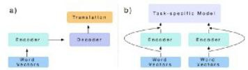
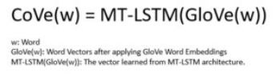
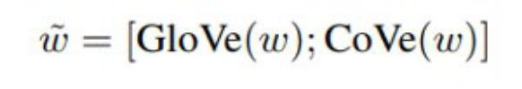

# Replacing your Word Embeddings by Contextualized Word Vectors

*October 20, 2018 by Edward Ma*


*“high-rise buildings” by Micaela Parente on Unsplashi*

Influenced from Mikolov et al. (2013) and Pennington et al. (2014), word embeddings become the basic step of initializing NLP project.
After that, lots of embeddings are introduced such as lda2vec (Moody Christopher, 2016), character embeddings, doc2vec and so on.
Today, we have new embeddings which is contextualized word embeddings.
The idea is similar but they achieve the same goal which is using a better word representation to solve NLP task.

After reading this post, you will understand:
- Contextualized Word Vectors Design
- Architecture
- Implementation
- Take Away

## Contextualized Word Vectors Design


*“white sand beach under white sky” by Itchy Feet on Unsplash*

Inspired by the CNN, McCAnn et al. focus on training an encoder and converting it to other task such that a better word representation can be leveraged.
Not using skip-gram (Mikolov et al., 2013) or matrix factorization (Pennington et al., 2014) but leveraging machine translation to build Contextualized Word Vectors (CoVe).

Assuming Machine Translation (MT) is general enough to capture the “meaning” of word, we build an encoder and decoder architecture to train a model for MT.
After that, we “transfer” the encoder layer to transferring word vectors in other NLP tasks such as classification problem and question answering problem.
 


*McCann B., Bradbury J., Xiong C., Socher R. (2017)*

Figure a shows how to train a model for Machine Translation.
Giving word vectors (e.g. GloVe) such that we can get Context Vectors (CoVe) from the model.

## Architecture



*McCann B., Bradbury J., Xiong C., Socher R. (2017)*

Figure b shows reuseing the encoder from result a and applying it in other NLP problem.



*McCann B., Bradbury J., Xiong C., Socher R. (2017)*

As showed in figure b, the input of “Task-specific Model” are Word Vectors (e.g. GloVe or word2vec) and Encoder (i.e. Result from MT).
Therefore, McCann et al. introduced the above formula to get the new word embeddings (concatenating GloVe(w) and CoVe(w)).

### Implementation

Before that you need to install corresponding libraries (Copy from CoVe github):

```bash
git clone https://github.com/salesforce/cove.git # use ssh: git@github.com:salesforce/cove.git
cd cove
pip install -r requirements.txt
python setup.py develop
# On CPU
python test/example.py --device -1
# On GPU
python test/example.py
```

If you face issue on “pip install -r requirements.txt” you may replace it by the following command

```bash
conda install -c pytorch pytorch
pip install -e git+https://github.com/jekbradbury/revtok.git#egg=revtok
pip install https://github.com/pytorch/text/archive/master.zip
```

If you use Keras (Tensorflow), you can follow this [notebook](https://github.com/makcedward/nlp/blob/master/sample/nlp-embeddings-word-cove.ipynb) to build CoVe.
However, there is some issue on the original notebook, you may check out my modified version for reference.
The issue is that original CoVe (pytorch updated name of layer from “rnn” to “rnn1”).
[Pre-trained model](https://github.com/rgsachin/CoVe) (download Keras_CoVe.h5) is available as well.

On the other hand, you can also use pre-converted Keras version as well.

 
```python
# Init CoVe Model
cove_model = keras.models.load_model(cove_file)# Init GloVe Model
glove_model = GloVeEmbeddings()        glove_model.load_model(dest_dir=word_embeddings_dir, process=False)# Encode sentence by GloVe
x_embs = glove_model.encode(tokens)# Encode GloVe vector by CoVe
x_embs = cove_model.predict(x_embs)
```

## Take Away
To access all code, you can visit this [github](https://github.com/makcedward/nlp/blob/master/sample/nlp-embeddings-word-cove.ipynb) repo.

- CoVe needs label data to get the contextual word vectors.
- Using GloVe to build CoVe
- CoVe unable to resolve OOV issue. It suggests to use zero vectors to represent unknown word.

## About Me

I am Data Scientist in Bay Area.
Focusing on state-of-the-art in Data Science, Artificial Intelligence , especially in NLP and platform related.
You can reach me from Medium Blog, LinkedIn or Github.

## Reference
McCann B., Bradbury J., Xiong C., Socher R.. Learned in Translation: Contextualized Word Vectors. 2017. http://papers.nips.cc/paper/7209-learned-in-translation-contextualized-word-vectors.pdf

[CoVe in Pytorch](https://github.com/salesforce/cove) (Original)

[CoVe in Keras](https://github.com/rgsachin/CoVe)