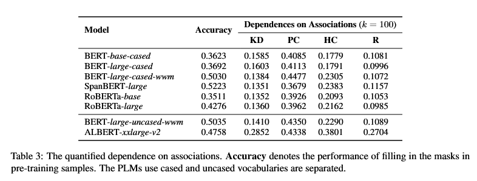
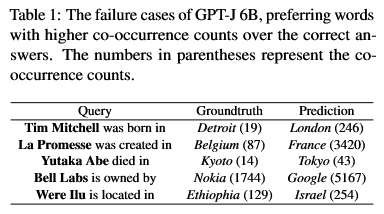
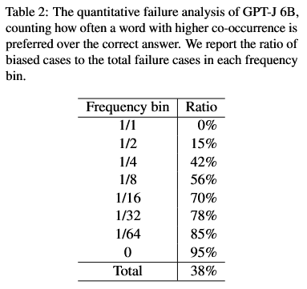
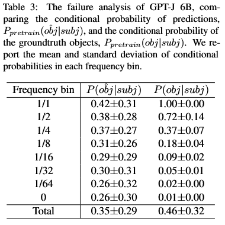

# New Paper Organization

[Google Sheets Link](https://docs.google.com/spreadsheets/d/13AIEp3gyqf4AO1MgAZmUANgor4021n0Bx-NNuwTvYqM/edit#gid=0)

# Papers

## [Exposing Attention Glitches with Flip-Flop Language Modeling](https://arxiv.org/abs/2306.00946)
- [Local Copy](PDFs/dola_decoding_by_contrasting_layers_improves_factuality_in_large_language_models.pdf)
- [Annotated Copy](PDFs/Annotated/exposing_attention_glitches_with_flip_flop_language_modeling_annotated.pdf)
- Experiment 1
    - Questions
        - Are transformer models able to learn a flip-flop language (FFL)?
        - Is there any difference in results on FFL tasks between recurrent and transformer architectures?
    - Conclusions
        - Transformers exhibit a long irregular tail of errors, such errors occur on both sparse and dense sequences. Further, a model’s out-of-distribution test error varies significantly between random seeds and even between iterations within the same training run.
        - LSTMs extrapolate perfectly. In stark contrast, with 20 times fewer training samples and iterations, a 1-layer recurrent model achieves 100% accuracy, on 100 out of 100 runs.
        - Larger LMs can correctly process FFLs, but not robustly. Beyond a certain scale, natural language models can learn to process FFLs from in-context demonstrations. However, this emergent capability is not robust: there exist rare read errors, whose probabilities amplify as the sequence length T grows.
    - Process
        - NLMs are trained to generate strings from $FFL(0.8)$ and probe whether the networks robustly learns the language. 
        - Although every valid flip-flop string is supported in this distribution, some sequences are far rarer than others; tail behavior is measured via probes of extrapolation, defined as out-of-distribution evaluations which amplify the probabilities of the rare sequences by sampling $>3\times10^5$ sequences from $FFL(0.98)$ as well as $FFL(0.1)$.
    - Observations
        - By construction, language models experience degradation of accuracy with dependency length, however there exist accuracy problems for short and dense sequences.
        - A common drawback of soft attention is the excessive "softness" of the softmax function, however, even hard attention is able to confidently attend the wrong index, suggesting the existence of spurious local optima.
- Experiment 2
    - Questions
        - What are some possible approaches to eliminate the long tail of reasoning errors exhibited by Transformer FFLMs?
    - Conclusions
        - Training on rare sequences works best, by a wide margin.
        - Resource scaling (in-distribution data, training steps, network size) helps. However, the improvements are generally smaller, and there exist tradeoffs between sparse and dense-sequence extrapolation.
        - Some architectural variants and regularization tricks have orders-of-magnitude effects on the out-of-distribution performance of Transformers: embedding dropout, attention-sharpening losses, and non-trainable position embeddings.
        - Despite many partial mitigations, nothing eliminates attention glitches entirely. 
    - Process
        - Try removing the need for out-of-distribution extrapolation, by training directly on more diverse examples.
        - Try straightforwardly increasing scale parameters in the model and training pipelines.
        - Try weight decay and dropout (at the attention, feedforward, and embedding layers), as well as a host of algorithmic choices known to modulate generalization (batch sizes, learning rates, optimizer hyperparameters, position embeddings, activation functions).
        - Try attention-sharpening regularizers.
        - Try directly simulating a flip-flop automaton (solvable by a 1-layer Transformer with a single attention head).
    - Observations
        - Attention patterns of the sparse models are less complex and easier to interpret compared to those of the un-regularized models.
        - Attention-sharpening regularization cannot fully eliminate the sporadic errors, which are partially induced by the complexity and redundancy of attention patterns. Moreover, sharpened attention can induce additional failure modes, such as confidently attending to incorrect write positions.
        - It is extremely difficult to find a setting that reliably produces Transformer models with simultaneous improvements over the baseline on sparse and dense sequences.
        - Due to factors such as overparameterization, spurious solutions, and the opaqueness of optimization dynamics, learned neural implementations of algorithms generally do not coincide with “ideal”, “minimal”, or “natural” theoretical constructions. 
- Datasets
    - Generated FFL samples
- Models
    - 1L 128HS LSTM
    - 6L 512D 8AH Baseline Transformer
    - GPT-2
    - GPT-2 Large
    - GPT-2 XL
    - Pythia-12C
    - GPT-NeoX-20B

## [DoLa: Decoding by Contrasting Layers Improves Factuality in Large Language Models](https://arxiv.org/abs/2309.03883)
- [Local Copy](PDFs/dola_decoding_by_contrasting_layers_improves_factuality_in_large_language_models.pdf)
- [Annotated Copy](PDFs/Annotated/dola_decoding_by_contrasting_layers_improves_factuality_in_large_language_models_annotated.pdf)
- [Github](https://github.com/voidism/DoLa)
- Experiment 1
    - Questions
        - Is it possible to exploit modular encoding of knowledge in a transformer architecture (early layers encode low level information and later layers encode semantic-like information) to amplify the factual knowledge in an LM?
    - Conclusions
        - Contrasting the differences between the different layers can make LMs more factual and consequently reduce hallucinations.
        - Introducing new decoding method: Decoding by Contrasting Layers (DoLa), for better surfacing factual knowledge embedded in an LLM without retrieving external knowledge or additional fine-tuning.
    - Process
        - Given an embedding layer, $N$ stacked transformer layers, and an affine layer $\Phi(\cdot)$ for predicting the next-word distribution. The embedding layer first embeds the tokens into a sequence of vectors $H_0$ processed by each layer, obtaining $H_j$ at layer $j$ and instead of applying $\Phi(\cdot)$ to the final layer, it is applied to every layer obtaining $q_j$ at layer $j$.
        - A premature layer $M$ is dynamically selected at each decoding step as the one maximizing a certain distance measure $d(\cdot, \cdot)$ (using the Jensen-Shannon Divergence $JSD$) between $q_N$ and $q_j$ for all candidate layers $j \in \mathcal{J}$.
        - The next token is predicted by applying the contrastive operator $\mathcal{F}(\cdot, \cdot)$ between $q_N$ and $q_M$.
        - Additional static variant that uses brute-force experiments on all the possible early layers with a validation set, and pick the layer with the best validation performance: DoLa-static.
        - If the predicted probability of a token is too small in the mature layer ($N$), it is not likely to be a reasonable prediction, so the token probability is set to zero to minimize false positive and false negative cases.
        - Since the DoLa objective disregards grammar, a simple repetition penalty is included.
    - Observations
        - The model is still changing its predictions in the last few layers, and potentially injecting more factual knowledge into the predictions when predicting important name entities or dates which require factual knowledge.
        - The model has already decided what token to generate in the early layers, so it just keeps the output distribution almost unchanged in the higher layers when predicting function words such as "was", "the", "to", "in", and the tokens that are copied from the input question.
        - DoLa-static has the drawbacks of large search space in layers, and the fact that best layers are sensitive to data distribution, thus requiring in-distribution validation sets.
- Experiment 2
    - Questions
        - How to evaluate DoLa performance and does DoLa provide benefits to the model?
    - Conclusions
        - Experimental results show that DoLa significantly improves truthfulness across multiple tasks without external information retrieval or model fine-tuning.
    - Process
        - Two types of tasks are examined: multiple choices and open-ended generation
        - Models are evaluated against various baselines: Original Decoding, Contrastive Decoding (CD)with expert models, and Inference Time Intervention (ITI).
        - For dynamic premature layer selection, transformer layers are partitioned into buckets and one bucket is selected as $\mathcal{J}$, only even-numbered layers are considered and the number of buckets depends on the size of the model.
        - In open-ended tasks ratings are judged by two fine-tuned GPT-3s on truthfulness and informativeness, a 100% truthfulness score can be easily achievable by not answering ("I have no comment") but results in a 0% informativeness score.
    - Observations
        - For multiple choice questions the proposed method consistently outperforms other baselines. In addition, the chosen candidate layers for the FACTOR dataset are always lower than the candidates for TruthfulQA, this might be because TruthfulQA's multiple-choice items have short, fact-critical responses, while FACTOR's are long sentence completions.  
        - The proposed method consistently enhances truthfulness scores, keeps informativeness above 90%, and has a ratio of refusing to answer (%Reject) under 10%, reaching performance level of ITI. CD boosts truthfulness but often refuses to answer.
        - For Chain-of-Thought (CoT) reasoning DoLa boosts accuracy by 1-4% across four LLaMA sizes, whereas CD mostly reduces performance (this implies that contrasting a large model with a smaller one can impair reasoning, as the smaller model also has certain level of reasoning ability).
        - On the Vicuna QA benchmark evaluated using GPT-4 DoLa notably outperforms the baseline, indicating that  DoLa is effective even in open-ended chatbot scenarios.
        - DoLa-static performs better by contrasting lower layers. Some "optimal" layers, even outperform DoLa. However, these optimal layers are sensitive across datasets, making DoLa-static less versatile without a task-specific validation set.
- Datasets
    - TruthfulQA
    - FACTOR (news + wiki)
    - StrategyQA
    - GSM8K
    - Vicuna QA benchmark
- Models
    - LLaMA (7B, 13B, 33B, 63B)
    - MPT-7B

# Recent transformer models/LLMs retain original embedding spatial properties?

#### GPT-2 vs Phi-1.5

GPT-2 steadily performs better on embedding arithmetic tasks versus Phi-1.5

#### Uppercase and lowercase

Generally words that are usually seen in a certain format perform better on embedding arithmetic tasks if prompted in that format.
(For example country names and cities are usually capitalized).

#### Multi-word average

There is no clear distinction between using an average of multiple words and a single word, provided that said words aren't too different from one another (averaging a capitalized word and a lowercase word doesn't work).

Averaging the embeddings of multi-token words seems to work, although it is clear that results are slightly worse.

#### Normalization

Normalizing the final embedding from the arithmetic operation always seems to improve the results, for all models and word combinations.

The performed normalization is provided by `torch.nn.functional.normalize` and defaults to a $L_2$ normalization of the vectors.

## Notes

- Evaluation method doesn't take into consideration that output embeddings may have multiple tokens
- It may be that some associations are not influenced by the actual embedding arithmetic equation components but simply output the closest embeddings to the target embedding.

# Co-occurrence

## How Pre-trained Language Models Capture Factual Knowledge? A Causal-Inspired Analysis

### PLMs prefer the associations founded with positionally close or the highly co-occurred words to the knowledge-base clues

- Sentences are sampled, for each sentence treatment $W_t$, outcome $W_o$ and context $W_c$ words are chosen.
- The outcome words are the target of the model's prediction (associated to the triplet *object*), treatment words are chosen with different criterions and are obfuscated with \[MASK\] tokens and context words are all the other words in a sentence.
- The treatment words criterions are:
    - KD (Knowledge Dependent): Words corresponding to *predicate + object* in triplet. Example: "*Drayton* is a hamlet in England, in the county of Northamptonshire, ..., in the parish and union of Daventry, hundred of Fawsley, ¾ of a mile on the low-lying north western side of the *town* of **Daventry**", *Drayton* and *town* are KD w.r.t. **Daventry**.
    - PC (Positionally Close): Remaining words close to $W_o$. Example: "Drayton is a hamlet in England, in the county of Northamptonshire, ..., in the parish and union of Daventry, hundred of Fawsley, ¾ of a mile on the low-lying north western side of the town *of* **Daventry**", *of* are PC w.r.t. **Daventry**.
    - HC (Highly Co-occurred): Remaining words that have high Pointwise Mutual Information (PMI) with $W_o$. Example "Drayton is a hamlet in England, in the county of Northamptonshire, ..., in the parish and union of *Daventry*, hundred of *Fawsley*, ¾ of a mile on the low-lying north western side of the town of **Daventry**", *Daventry* and *Fawsley* are HC w.r.t. **Daventry**.
- PMI is calculated over all the Wikipedia sentences using the following equation: $PMI(w_i, \hat w_o) = \frac{P(w_i|\hat w_o)}{P(w_i)}$ where $\hat w_o$ is a span of words and $w_i$ a single word.
- The Average Treatment Effect is calculated by computing the difference between the expected values of the $W_o$ probabilities given $W_t$ the ground truth value $\hat w_t$ vs. the intervention value $w_m$ : $\mathbb{E}[P(W_o | W_t=\hat w_t)] - \mathbb{E}[P(W_o | W_t=w_m)]$.
- The PLM output is calculated by using the reciprocal of the rank position of $\hat w_o$ according to the raw generation probability of the model.
- There is a general trend over all PLMs: the PC association takes the dominant effect on the prediction results, the HC association comes second and least for the KD association.
The trend doesn't change much with scale, using additional training data or improving the masking strategy. Consequently, accuracy drops most when perturbing the positionally close and highly co-occurred words.

## Impact of Co-occurrence on Factual Knowledge of Large Language Models

- Co-occurrence statistics are necessary but not sufficient to recall facts, therefore, a heavy reliance on co-occurrence may be problematic.
- The model fails to recall facts by selecting words with higher co-occurrence counts over the correct answers. This implies that co-occurrence statistics may often work as spurious features, leading to hallucinations and biased responses.

- It is also measured how often the correct answer is overridden by a word with higher co-occurrence counts.
- A word with higher co-occurrence counts overrides the correct answer in a total of 38% of the failure cases.
- The frequency bins indicate the co-occurrence bias is more problematic when recalling rare facts.

- The results show that LLMs prefer to generate words that co-occur with the subject frequently enough ($P_{\text{pretrain}}(o \hat b j | \text{subj}) \ge 0.26$).
- Recalling facts is especially difficult since words with low co-occurrence counts are hardly generated.

# Previous Meeting Ideas

## 28/11/23 w/ Mark, Nicolò, Vincenzo

- Experiment ideas
    - Turn off feed forward layers, only residuals and attention
    - Turn off attention layers, only residuals and feedforward
        - Hypothesis: Results in a markov model -> pure prediction of next word without fact association
    - 1-layer model with cycling information
        - [Universal Transformer](https://arxiv.org/abs/1807.03819)
        - Adapt an LLM to act as a Universal Transformer

- Other stuff
    - Find examples for co-occurrence problem
    - Test if recent transformer models/LLMs retain original embedding spatial properties

## 30/11/23 w/ Nicolò, Vincenzo

- Restating new research topics
    - How does the memory of a model work/change when learning new facts?
    - Where is the memory of a model stored, and how is it represented?

- Organize previous papers on a spreadsheet

- New papers
    - [Exposing Attention Glitches with Flip-Flop Language Modeling](https://arxiv.org/abs/2306.00946)
    - [DoLa: Decoding by Contrasting Layers Improves Factuality in Large Language Models](https://arxiv.org/abs/2309.03883)
        - https://github.com/voidism/DoLa

- Verify classic spatial embedding properties on newer transformer models