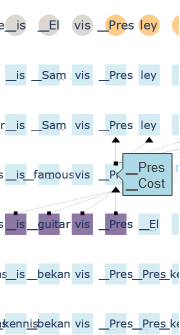

# Notes

## Possible encoding of number decimal value

While testing the attention visualization utilizing the option to display multiple representations of hidden states with the Mistral 7B model an interesting pattern of secondary representations was found.

Example produced by running a prompt that asked the model to solve an addition in the form of _"xxxxxx + yyyyyy ="_ and looking at the hidden representations of numeric tokens from the perspective of input embeddings (valid for both hidden representations present in the input and generated tokens).

At a certain number of layers inside the model, hidden states of digits tend to display a secondary representation that directly correlates with their decimal position inside the number e.g. "_hundred", "_thousand", "_million", ...

The secondary representation is not always correct and might correlate with arithmetic errors made by the model.

Interestingly enough, for the decimal position corresponding to "10.000", Mistral 7B seems to use the ideogram 万, which tends to be associated with that particular value in the japanese language.

In addition, for some two-digit or three-digit combinations, Mistral 7B tries to encode the latter digit with the term combining all of the previous ones (e.g. 1,3 -> _thirteen). This happens only for the first two/three digits of a number as the later digits secondary representations are dominated by the previously analyzed terms.

Examples:
- 128717593 + 8191493 =

# Previous Meeting Ideas

## 22/02/24 Group Meeting

### Ideas + Tasks

- [X] Try using Mistral7B model

#### Head Attention Contribution

- Cosine Similarity may not be the optimal way to measure the contribution of each head.

- [X] Variance in length of the vectors could be an interesting measure.

- [X] "Forced inputs" are handled differently than tokens generated by the model, and watching attention contributions of the input sentence may be misleading.
- > By looking at the correlation between cosine similarity and L2 Norm measures for the attention head contributions, it's possible to observe a significant increase in value across all statistics. Given the prompt "Better safe than" with a Mistral 7B model, taking the first 10 tokens (input included) head contribution cosine-L2 correlations we have (Pearson: 0.3065 p=0.0879, Spearman: 0.6382 p=8.5\*10^-5, Kendall: 0.4234 p=0.0005) and for the last 10 tokens we have (Pearson: 0.6540 p=4\*9195, Spearman: 0.6587 p=4.2*10^-5, Kendall: 0.4637 p=0.0001).

- Accumulate more examples to build more statistical significance over observations.

#### Hidden Representation Embedding Multi-Representation

- [X] Try normalizing hidden representations using the model's normalization technique, rather than normalizing them to simply have norm 1.
- > Results are overall worse w.r.t. no normalization: presence of more meaningless tokens and norms frequently increase instead of decreasing.

- [X] Try Elvis musician test and see which "Elvises" are predicted.
- > Indeed, at some point on the prediction of the first "Presley" token, the model has "Costello" as a second possible hidden state representation. Tested using Mistral 7B and the following prompt: "Son of an actor, this American guitarist and rock singer released many songs and albums and toured with his band. His name is Elvis" (the model completes with "_Presley"). 

#### Attention Interactive Visualization

- [X] Try changing the background of the text directly in the visualization, instead of using square markers.
- > [Not possible]

- [ ] Give options to remove thresholds, eventually playing around with minimum and maximum width in order to avoid cluttering the visualization.

- [ ] Start working with Nicolò to incorporate visualizations:
    - Refer to the mockup
    - Show both attention, FF and residual contributions

- Final idea is, given any token inside any layer, to make possible to trace back from where it was formed inside the model. To this end, it is only relevant to weight each contribution (attention, attention weights, FF, residuals, ...) functionally to how it contributes to the current token that is being examined.

## 27/02/24 Meeting with Nicolò + Vincenzo

### Tasks

- [ ] Transition to L2 norm from cosine similarity for head contribution measures.

- [X] Start implementing Sankey Diagram for attention visualization.
    - Each token/layer is represented by a rectangle, attention weights are represented by traces.

- [X] Adapt old analogies notebook to work with new models.
    - Add new metrics, Top-k accuracy, ...
    - Focus on dataset generalizability. 

- [X] Take a look at Google Gemma model.

## Teams messages

### Experiments

#### Sankey Visualization

I was talking with Nicolò about generating visualisations in plotly+dash. 
I think that the best (and simplest) way to visualise the flow of information in the network may be to use a Sankey Diagram oriented in the vertical direction. 
- See examples of the diagrams here: https://plotly.com/python/sankey-diagram/
- And examples of vertically oriented ones here: https://stackoverflow.com/questions/74657646/plotly-sankey-how-to-use-defined-node-positions-with-vertical-orientation-wit
- Information on how to align rows/columns here: https://stackoverflow.com/questions/61152889/plotly-how-to-set-node-positions-in-a-sankey-diagram?rq=4

I was wrong to say that Sankey expects internal nodes to have the same total inflow as outflow. While that is the "normal case", I think the layout engine just uses the maximum of the two to decide how wide to make the boxes. So internal nodes can be partial generators or consumers.

I think it may make sense to look at a single output token -- say the last position on the input text sequence (so the first generated token) and make a Sankey diagram just for that token by following the sources back weighted by their importance at each level.
So at the last level we would first calculate the residual percentage and the self-attention percentages, and then multiply the latter by the average attention weights (over the heads) for each incoming link (adding in the residual for the link from the same position). This would then give us importance values for each token at the next level down. We'd then repeat the process for all those tokens and calculate weights for the level below (summing over all links to get importances), and continue iteratively ....

Another day, another visualization idea ....
After you've got the current version working, I would like to try also the gradients: like for gradcam, assume generated term(s) are correct, calculate gradients back over hidden representations, compute L2 norm of gradient vectors and visualise it as importance of node.

Can you control the colours of the nodes? I'd make the nodes all the same colour (say red) and then vary the shading on them either by layer or row position.

#### Embeddings Analogies

I suggest you also try the advanced version of the analogy where the predicate is the average of many examples, in order to demonstrate the existence of the knowledge in the embedding representation:
 
- delta_capitalOf = AVG( emb['_Chairo'] - emb['_Egypt'], emb['_Canberra'] - emb['_Australia'], emb['_Tokyo'] - emb['_Japan'], ...)
- emb['_France'] + delta_capitalOf = ?

### First Order Markov Model

- I was thinking about the fact that Llama/Mistral/etc. use different input and output embeddings (decoders) and also the fact that the task of a GPT-like model is to predict the next word -- as opposed to a BERT-like model that needs to recover the word.
- Thus the first-order approximation for a BERT-like model would be to simply use the residual connections to "pass through the input token to the output", i.e. produce the model $P(\text{output\_token}_i = y | \text{input\_token}_i = x) = 1(x==y)$. 
- This can be achieved by simply using the inverse (i.e. same) embedding at input and output: $Output\_Embedding^{-1}[Input\_Embeddding[token_i]] = token_i$,  where by $embedding^{-1}$ I mean to apply an argmax over the dot-product between the $embedding\_weight\_vector$ and the $hidden\_representation\_vector$.
- Meanwhile the first-order approximation for a GPT-like model would be a first-order Markov model, where the residual is used to pass up the input token (as with BERT), so that the decoding output embedding can predict the most likely next word based on it: i.e. produce the model $P(\text{output\_token}_i = y | \text{input\_token}_i = x) = P("x y")/P("x")$
- Which means that for GPT-like models the output embedding/decoder should be different from the input embedding/decoder and that we should see this effect if we apply it to words: $Output_Embedding^{-1}[Input\_Embeddding[token_i]] = ???$
- If over a set of input tokens, the returned token is indeed likely the 1st order Markov model prediction that would be super cool to show!
- You can get some ngram counts from Google Ngrams: https://books.google.com/ngrams/

We could look at the KL-divergence between the distributions, but if the most likely token isn't what was expected then we're unlikely to see anything interesting comparing the distributions