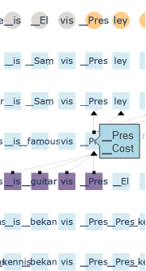

# Notes

## Possible encoding of number decimal value

While testing the attention visualization utilizing the option to display multiple representations of hidden states with the Mistral 7B model an interesting pattern of secondary representations was found.

Example produced by running a prompt that asked the model to solve an addition in the form of _"xxxxxx + yyyyyy ="_ and looking at the hidden representations of numeric tokens from the perspective of input embeddings (valid for both hidden representations present in the input and generated tokens).

At a certain number of layers inside the model, hidden states of digits tend to display a secondary representation that directly correlates with their decimal position inside the number e.g. "_hundred", "_thousand", "_million", ...

The secondary representation is not always correct and might correlate with arithmetic errors made by the model.

Interestingly enough, for the decimal position corresponding to "10.000", Mistral 7B seems to use the ideogram 万, which tends to be associated with that particular value in the japanese language.

In addition, for some two-digit or three-digit combinations, Mistral 7B tries to encode the latter digit with the term combining all of the previous ones (e.g. 1,3 -> _thirteen). This happens only for the first two/three digits of a number as the later digits secondary representations are dominated by the previously analyzed terms.

Examples:
- 128717593 + 8191493 =

# Previous Meeting Ideas

## 22/02/24 Group Meeting

### Ideas + Tasks

- [X] Try using Mistral7B model

#### Head Attention Contribution

- Cosine Similarity may not be the optimal way to measure the contribution of each head.

- [X] Variance in length of the vectors could be an interesting measure.

- [X] "Forced inputs" are handled differently than tokens generated by the model, and watching attention contributions of the input sentence may be misleading.
- > By looking at the correlation between cosine similarity and L2 Norm measures for the attention head contributions, it's possible to observe a significant increase in value across all statistics. Given the prompt "Better safe than" with a Mistral 7B model, taking the first 10 tokens (input included) head contribution cosine-L2 correlations we have (Pearson: 0.3065 p=0.0879, Spearman: 0.6382 p=8.5\*10^-5, Kendall: 0.4234 p=0.0005) and for the last 10 tokens we have (Pearson: 0.6540 p=4\*9195, Spearman: 0.6587 p=4.2*10^-5, Kendall: 0.4637 p=0.0001).

- Accumulate more examples to build more statistical significance over observations.

#### Hidden Representation Embedding Multi-Representation

- [X] Try normalizing hidden representations using the model's normalization technique, rather than normalizing them to simply have norm 1.
- > Results are overall worse w.r.t. no normalization: presence of more meaningless tokens and norms frequently increase instead of decreasing.

- [X] Try Elvis musician test and see which "Elvises" are predicted.
- > Indeed, at some point on the prediction of the first "Presley" token, the model has "Costello" as a second possible hidden state representation. Tested using Mistral 7B and the following prompt: "Son of an actor, this American guitarist and rock singer released many songs and albums and toured with his band. His name is Elvis" (the model completes with "_Presley"). 

#### Attention Interactive Visualization

- [X] Try changing the background of the text directly in the visualization, instead of using square markers.
- > [Not possible]

- [ ] Give options to remove thresholds, eventually playing around with minimum and maximum width in order to avoid cluttering the visualization.

- [ ] Start working with Nicolò to incorporate visualizations:
    - Refer to the mockup
    - Show both attention, FF and residual contributions

- Final idea is, given any token inside any layer, to make possible to trace back from where it was formed inside the model. To this end, it is only relevant to weight each contribution (attention, attention weights, FF, residuals, ...) functionally to how it contributes to the current token that is being examined.

## 27/02/24 Meeting with Nicolò + Vincenzo

### Tasks

- [ ] Transition to L2 norm from cosine similarity for head contribution measures.

- [ ] Start implementing Sankey Diagram for attention visualization.
    - Each token/layer is represented by a rectangle, attention weights are represented by traces.

- [ ] Adapt old analogies notebook to work with new models.
    - Add new metrics, Top-k accuracy, ...
    - Focus on dataset generalizability. 

- [ ] Take a look at Google Gemma model.

## Teams messages

### Experiments